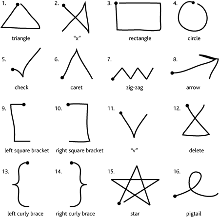

[](https://classroom.github.com/a/HqZjtAXJ)

# Setup

1. Clone the repo
2. `cd` into the **root** directory
3. Setup and activate a virtual env **(Python 3.12)**
4. `pip install -r requirements.txt`
5. Download the `Unistroke gesture logs: XML` from [Wobbrock's Website](https://depts.washington.edu/acelab/proj/dollar/index.html)
6. Move the dataset into the `datasets/xml_logs` directory

> ⚠️ Due to some import shenanigans you **must** run all applications as modules `-m` **from the root directory**

# $1 Gesture Recognizer

This program is a python implementation of the [1$ Unistroke Recognizer](https://depts.washington.edu/acelab/proj/dollar/index.html).  
It was modeled based on [this pseudo-code](https://depts.washington.edu/acelab/proj/dollar/dollar.pdf).  
The `Recognizer` class loads the gesture templates on initialization and provides a `recognize` method to label a path array.  
It can be tested via a GUI using the instructions below.  

```sh
python -m recognizer.pyglet_gui -a
```

Draw any of the shapes present in the template shapes by pressing and holding `Left Click`.  
Once you let go of `Left Click` the closest matching shape will be overlayed where you drew your shape with a label and confidence value at the top.  
<div align="left">
    
</div>

# Mid-Air Gestures with $1 Recognizer

This program gives you the ability to move your pointer and press mouse buttons.  
When it opens it automatically launches the GUI from Task 1 (Can be minimized if not needed).  

```sh
# Debug flag is optional
python -m pointing_input.pointing_input --video-id 0 -d
```


## Control Instructions

The application is controlled using simple gestures.     

- `Connecting` **index** finger and **thumb** will trigger `Left Mouse Button Down`  
- `Releasing` **index** finger and **thumb** will trigger `Left Mouse Button Up`  
- `Holding` **index** finger and **thumb** will move the mouse 
- `Extending` **index** finger will move the mouse

You can quickly tap index and thumb together to simulate a click.  
Now you can draw in the recognizer GUI.  

> ⚠️ The inputs are actively smoothed slightly to allow precise movement at the cost of a minimal delay
The delay is noticeable but better than jittery input
